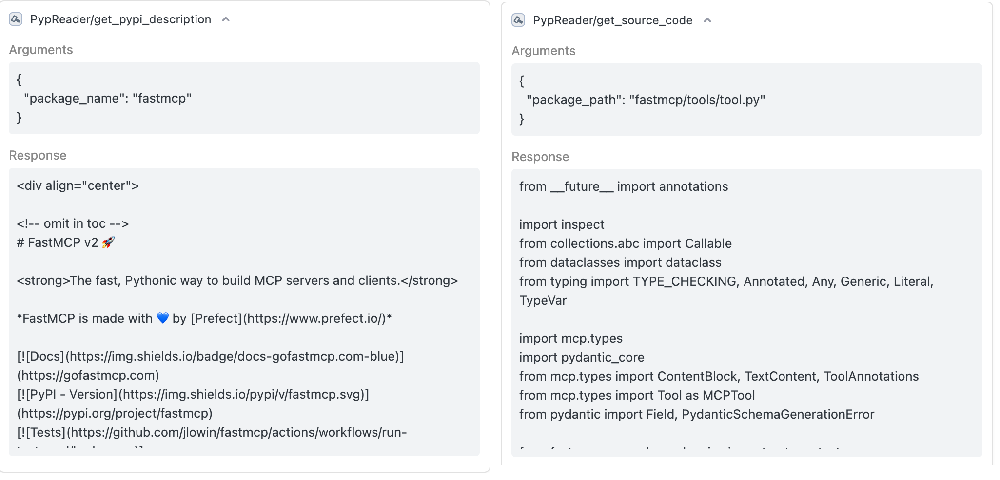

# pypreader-mcp

[English](./README.md) | [简体中文](./README_zh.md)

[](https://www.python.org/)
[](https://opensource.org/licenses/MIT)

An MCP-Server that reads the contents of Python packages. This Server allows Large Language Models (LLMs) and other AI Agents to inspect the contents of Python packages in a specified environment.

## Overview

`pypreader-mcp` acts as a bridge between AI models and the local Python environment. By exposing a set of tools via MCP, it enables AI to programmatically browse installed packages, view their file structures, and read their source code. This is useful for tasks such as code analysis, dependency checking, and automated programming assistance.

### Why build this?

When I use AI-integrated programming IDEs like Cursor or Trae, I always find that the currently used model is unaware of the third-party libraries I need.

But sometimes they pretend to know and seriously generate a bunch of indescribable stuff; other times they search the internet, but the results are mostly not good, making it hard to find any useful information.

So I created this MCP service. It can read documentation from the official website pypi.org or read source code from the site-packages environment corresponding to your Python, allowing for a more direct understanding of the contents of the third-party libraries you want to use.

## Features

This Server provides the following tools to MCP clients:

- `get_pypi_description(package_name: str)`: Retrieve the official description of a package from PyPI.
- `get_package_directory(package_name: str)`: List the entire file and directory structure of a specified installed package.
- `get_source_code_by_path(package_path: str)`: Retrieve the complete source code of a specific file within a package.
- `get_source_code_by_symbol(package_path: str, symbol_name: str)`: Get the definition (code snippet) of a specified symbol (function, class, etc.).

## Usage

This tool is designed to act as an MCP Server for use in AI-based environments such as [Cursor](https://cursor.sh/) or [Trae](https://trae.ai/).

### Configuration

In the MCP Server configuration of your AI environment, add a new Server with the following settings. This allows the AI to run the service directly from its Git repository using `uvx`.

```json
{
  "mcpServers": {
    "PypReader-MCP": {
      "command": "uvx",
      "args": [
        "--from",
        "git+https://github.com/zakahan/pypreader-mcp.git",
        "pypreader-mcp"
      ],
      "env": {
        "CURRENT_PYTHON_PATH": "<your-python-path>",
        "CURRENT_LOGGING_LEVEL": "INFO"
      }
    }
  }
}
```

### MCP-Server Parameters

When configuring the MCP Server in your AI environment, you can specify the following env parameters:

- `CURRENT_PYTHON_PATH`: Specifies the path to the Python executable of the target package installation environment. If not provided, it defaults to the Python executable running the Server. You can find the correct path by activating your project's Python environment and running `which python` in the terminal.
- `CURRENT_LOGGING_LEVEL`: Sets the logging level of the Server. Options are `DEBUG`, `INFO`, `WARNING`, `ERROR`, `CRITICAL`. The default value is `INFO`.

If you use a Python virtual environment to configure your Python project, you typically need to modify `python_path` as needed to switch to your specified Python environment.

### AI Coding Example

Take Trae as an example. As of now (2025-07-02), the doubao-seed-1.6 model is unaware of the `fastmcp` package (in fact, most models don't recognize it either). Under normal circumstances, it would either pretend to know and output a bunch of messy, indescribable incorrect content (even thinking I'm talking about FastAPI), or perform a clumsy search and find all sorts of disorganized information.

This time, I created a Trae agent equipped with this project's mcp-server. The result is as follows: Trae can understand my project and then write a `fastmcp` service to complete my task.

**This is the entire process of Trae completing my requested task**


**These are the specific details of the tool calls**




## License

This project is licensed under the MIT License. For details, please refer to the [LICENSE](LICENSE) file.

### What's New Now?

- 2025-07-04: Rewrote the `get_source_code_by_symbol` tool to fix the issue where it couldn't read classes or functions belonging to sub-packages.


### What's Next?

1. Resolve the issue where `python-package-name` is inconsistent with the actual path, e.g., the package name `google-adk` has an actual path of `google/adk` and is actually imported as `google.adk`
2. Design a suitable prompt for the Agent. (The Trae version is [here](./assets/prompts/trae.md))