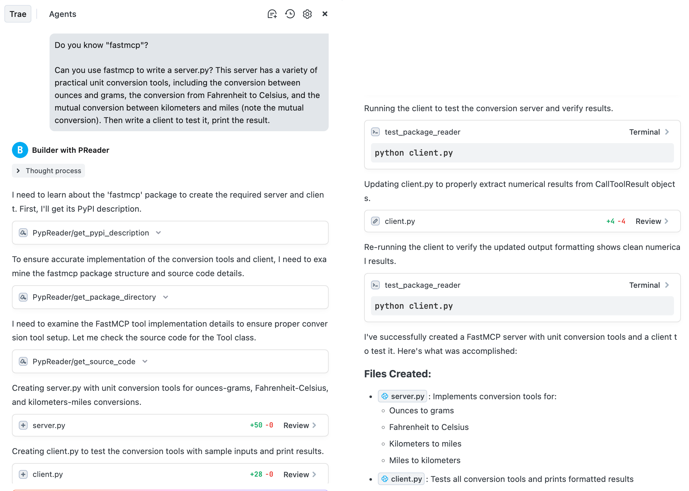

# pypreader-mcp

[English](./README.md) | [简体中文](./README_zh.md)

[](https://www.python.org/)
[](https://opensource.org/licenses/MIT)

一个实现了模型上下文协议（MCP）的Python包读取Server。该Server允许大语言模型（LLMs）和其他 AI 代理检查指定环境中 Python 包的内容。

## 概述

`pypreader-mcp` 充当 AI 模型和本地Python环境之间的桥梁。通过模型上下文协议暴露一组工具，它使 AI 能够以编程方式浏览已安装的包，查看其文件结构，并读取其源代码。这对于代码分析、依赖项检查和自动化编程辅助等任务非常有用。

### 为啥做了这个东西？

当我使用集成了 AI 的编程 IDE，如Cursor或Trae时，我总是发现当前使用的模型不知道我需要的第三方库。有时他们会很认真的生成一堆不可名状的东西，有时候它们会去互联网搜索时，但基本上结果都是不咋地，很难找到任何有用的信息。

所以我制作了这个 MCP 服务。它可以从官方网站 pypi.org 读取文档，或者读取你 Python 对应的 site-packages 环境中的源代码，以便更直接地了解你想使用的第三方库的内容。

## 功能

该Server向 MCP 客户端提供以下工具：

- `get_pypi_description(package_name: str)`：从 PyPI 获取包的官方描述。
- `get_package_directory(package_name: str)`：列出指定已安装包的整个文件和目录结构。
- `get_source_code_by_path(package_path: str)`：检索包内特定文件的完整源代码。
- `get_source_code_by_symbol(package_path: str, symbol_name: str)`：获取指定符号（函数、类等）的定义（代码段）。

## 用法

此工具旨在作为一个 MCP Server，在诸如 [Cursor](https://cursor.sh/) 或 [Trae](https://trae.ai/) 等基于 AI 的环境中使用。它不适合直接克隆并手动运行。

### 配置

在你的 AI 环境的 MCP Server配置中，添加一个具有以下设置的新Server。这允许 AI 使用 `uvx` 直接从其 Git 存储库运行服务。

```json
{
  "mcpServers": {
    "PypReader": {
      "command": "uvx",
      "args": [
        "--from",
        "git+https://github.com/zakahan/pypreader-mcp.git",
        "pypreader-mcp",
        "--python_path",
        "/path/to/your/project/.venv/bin/python" 
      ]
    }
  }
}
```

**配置详情**：

- **`command`**： `uvx`，它是一个用于从各种来源运行 Python 应用程序的工具。
- **`args`**：
    - `--from git+https://github.com/zakahan/pypreader-mcp.git`：告诉 `uvx` 从这个 Git 存储库获取包。
    - `pypreader-mcp`：要运行的控制台脚本的名称（在 `pyproject.toml` 中定义）。
    - `--python_path`：**至关重要的是**，你必须提供你希望 AI 检查的环境的 Python 可执行文件的绝对路径。这可能是你项目的虚拟环境。

### MCP-Server参数

在你的 AI 环境中配置 MCP Server时，你可以指定以下命令行参数：

- `--python_path`：指定目标包安装环境的 Python 可执行文件的路径。如果未提供，它将默认为运行Server的 Python 可执行文件。你可以通过激活项目的 Python 环境并在终端中运行 `which python` 来找到正确的路径。
- `--logging_level`：设置Server的日志记录级别。选项有 `DEBUG`、`INFO`、`WARNING`、`ERROR`、`CRITICAL`。默认值是 `INFO`。

如果你使用 Python 虚拟环境来配置 Python 项目，通常，你需要随时修改 `python_path`，以切换到你指定的 Python 环境。

### AI 编码示例

以 Trae 为例。目前（2025-07-02），doubao-seed-1.6 模型不知道 `fastmcp` 包（其实大部分模型也不认识）。在正常情况下，它要么会假装自己知道然后输出一堆乱七八糟、难以描述的错误内容，甚至会觉得我是在说FastAPI，要么就会进行生硬的搜索，找到各种杂乱的信息。

这次，我创建了一个 Trae 智能体，它配备了这个项目的 mcp-server。结果如下，Trae 可以理解我的项目，然后编写 `fastmcp` 的服务来完成我的任务。

**这是 Trae 完成我请求的任务的整个过程**



**这些是工具调用的具体细节**


### 使用客户端进行测试

如果你想测试我的这个服务或了解其功能，可以使用像 `fastmcp` 这样的client。`examples/fastmcp_client.py` 中的代码演示了如何连接到Server并调用其工具。

## 开发

1.  **设置**：克隆存储库并创建一个虚拟环境。

    ```bash
    git clone https://github.com/your-username/pypreader-mcp.git
    cd pypreader-mcp
    uv venv --python 3.10
    source .venv/bin/activate
    ```

2.  **安装依赖项**：以可编辑模式安装包及其开发依赖项。

    ```bash
    pip install -e ".[dev]"
    ```

3.  **代码质量**：这个项目使用 `ruff` 进行代码检查和格式化，通过 `pre-commit` 进行管理。

    ```bash
    # 安装 pre-commit 钩子
    pre-commit install

    # 对所有文件运行
    pre-commit run --all-files
    ```

## 许可证

本项目采用 MIT 许可证。有关详细信息，请参阅 [LICENSE](LICENSE) 文件。

### What's New Now?

- 2025-07-04: 重写了`get_source_code_by_symbol`工具，修复了无法读取子package所属的类或函数的问题。


### What's Next?

1. 解决`python-package-name`与实际路径不一致的问题，例如`google-adk`的包名，实际路径却是`google.adk`
2. 设计一个比较合适的prompt，用于Agent。